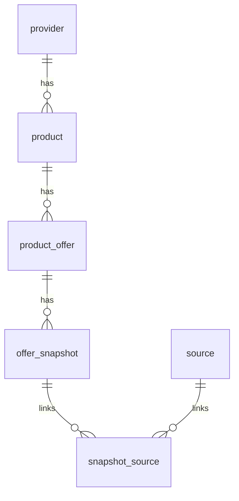

## Data Architecture — Savings Yield Optimiser

This document describes the **current data architecture** of the system: the SQLite schema, the conceptual model, how “current” data is served, and the main write/read patterns.

Source of truth:
- Schema: `backend/sql/schema.sql`
- Table read queries: `backend/app/repositories/offers.py`
- API shapes: `backend/app/schemas/api.py`

---

## 1) Storage model (local-first SQLite)

- The SQLite DB file lives at **`data/app.db`** (created at runtime).
- The DB is the **system of record**: all UI tables are derived from SQLite reads.
- A key architectural choice is **stable offers + immutable snapshots**:
  - Stable “offer identity” is stored once and updated via pointers.
  - “Observed facts” (rate values, flags, deposit bounds, etc.) are written as snapshots over time.

---

## 2) Conceptual model (entities)

### 2.1 Provider and Product

- **`provider`**
  - “Who offers it” (bank/building society name).
  - Uniqueness: `UNIQUE(name)`.

- **`product`**
  - A product marketed by a provider.
  - `product_type` is one of: `fixed_savings` or `cash_isa`.
  - Uniqueness: `UNIQUE(provider_id, name, product_type)`.

### 2.2 Stable offer (“thing we rank”)

- **`product_offer`**
  - Represents a stable offer variant that belongs to a **comparable set**.
  - Comparable-set keys:
    - `category` (e.g. `fixed_savings`, `cash_isa_easy_access`, `cash_isa_fixed`)
    - `term_months` (\(-1\) for unknown/not applicable)
    - `isa_subtype` (`easy_access` / `fixed` / etc., or empty string when unknown)
  - Uniqueness: `UNIQUE(product_id, category, term_months, isa_subtype)`.
  - Pointer: `current_snapshot_id` points at the snapshot currently used for UI reads.

### 2.3 Snapshot (“facts observed at a time”)

- **`offer_snapshot`**
  - Immutable observation of an offer at a point in time.
  - Key field: `verified_at` (ISO UTC string) — drives “Last checked”.
  - Uniqueness: `UNIQUE(offer_id, verified_at)` prevents duplicate snapshots for the same check time.
  - Holds all changeable facts:
    - rates (`aer_percent`, `gross_percent`, `rate_type`, etc.)
    - restrictions (`new_customer_only`, `new_money_required`, etc.)
    - deposit bounds (`min_opening_deposit_gbp`, `max_balance_gbp`)
    - mechanics (withdrawals, payout frequency, transfer flags)
    - optional notes/text fields

### 2.4 Provenance (source traceability)

- **`source`**
  - A unique URL referenced by snapshots.
  - Uniqueness: `UNIQUE(url)`.

- **`snapshot_source`**
  - Many-to-many join between `offer_snapshot` and `source`.
  - Ensures every snapshot can be traced back to one or more URLs.

### 2.5 Operational history (refresh jobs)

- **`ingestion_job_run`**
  - Persists refresh runs so history survives restarts.
  - Fields:
    - `job_run_id` (text primary key)
    - `job_type`: `scheduler` or `admin`
    - `status`: `running`, `succeeded`, `failed`
    - timestamps: `started_at`, `finished_at`
    - `error` (optional)
  - Indexed by `started_at DESC` for fast “recent history”.

---

## 3) Relationships (ER overview)

Interpretation:
- Each provider can have many products.
- Each product can have many stable offers (by category/term/subtype).
- Each stable offer can have many snapshots over time.
- Each snapshot can link to one or more sources (URLs).

---

## 4) “Current snapshot” pattern (how tables stay fast)

The UI tables do **not** scan all snapshots.

Instead, reads join through `product_offer.current_snapshot_id`:
- A refresh run writes a new snapshot (if needed)
- Then updates the stable offer to point its `current_snapshot_id` at the newest snapshot

This gives:
- Fast reads (only current rows)
- Retained history (prior snapshots remain in `offer_snapshot`)

---

## 5) Read model (what the frontend consumes)

### 5.1 Table endpoints

Table endpoints return `TableResponse`:
- `{ "items": [TableRow, ...] }`

Key fields the UI relies on:
- `offer_id`, `provider_name`, `product_name`, `category`
- `term_months` (nullable; `NULL` is used when DB stores `-1`)
- `aer_percent`
- `verified_at` (Last checked)
- `source_url` (a single representative URL)
- `badges` (derived from snapshot flags)

### 5.2 Query rules (as implemented)

From `offers.py`:
- Filters always enforce active status:
  - `product_offer.status = 'active'`
  - `offer_snapshot.status = 'active'`
- Fixed-term categories apply term filtering only when provided:
  - `fixed_savings` and `cash_isa_fixed`
  - “All terms” is implemented by *omitting* the `po.term_months = ...` predicate.
- Deposit filter:
  - `min_opening_deposit_gbp <= deposit` (or NULL)
  - `max_balance_gbp >= deposit` (or NULL)
- Restricted filter (MVP definition):
  - excludes offers where `new_customer_only` or `new_money_required` are set

Source URL selection:
- `source_url` is chosen as the first linked URL for the snapshot (lowest `source_id`).

---

## 6) Write model (ingestion/upsert behavior)

The refresh pipeline writes in this logical order:
1. Ensure **provider** exists
2. Ensure **product** exists (typed)
3. Ensure **product_offer** exists (stable identity)
4. Insert **offer_snapshot** (immutable observation) with `verified_at`
5. Ensure **source** exists for the provenance URL
6. Link snapshot ↔ source in **snapshot_source**
7. Update **product_offer.current_snapshot_id** to the new snapshot

Important characteristics:
- **Idempotent**: repeated ingestions should converge on the same stable offers.
- **Append-only snapshots**: new checks produce new snapshots (subject to `(offer_id, verified_at)` uniqueness).

---

## 7) Indexing and performance notes

Current indexes support common queries:
- `idx_offer_category_term_status` accelerates table filtering by category/term/status.
- `idx_snapshot_offer_verified` supports “latest snapshot” access patterns.
- `idx_snapshot_aer` supports ordering/lookup by AER values.
- `idx_ingestion_job_run_started` supports listing recent refresh history.

For MVP scale, this is sufficient. If data volume grows, consider:
- explicit pagination for table endpoints
- partitioning/archiving older snapshots (still preserving auditability)

