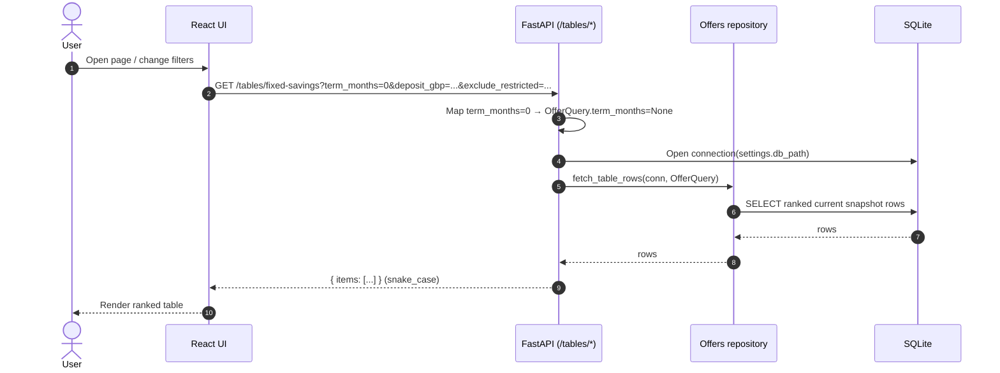
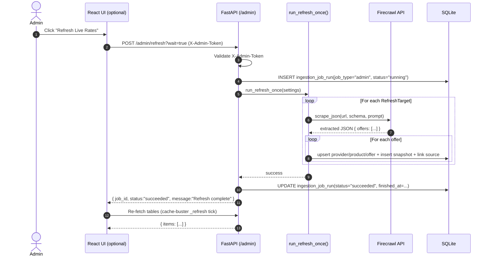
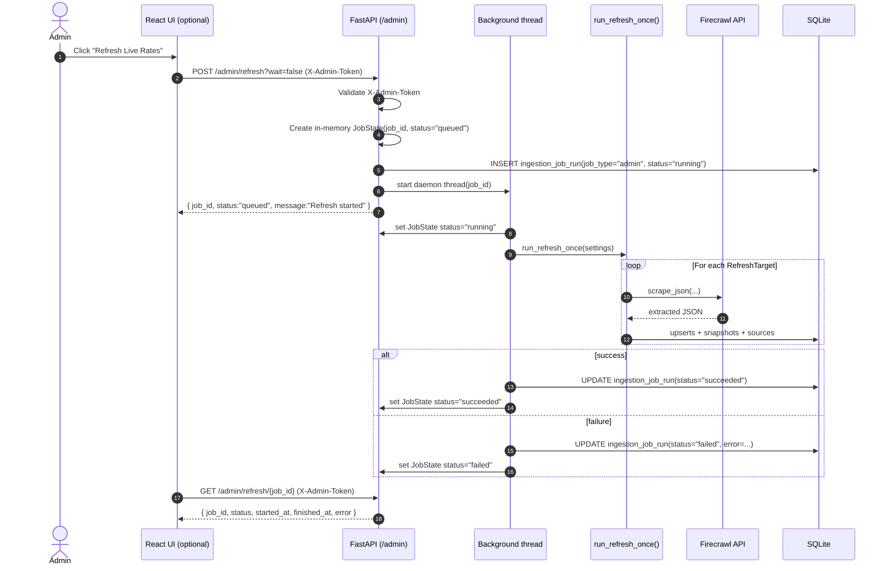
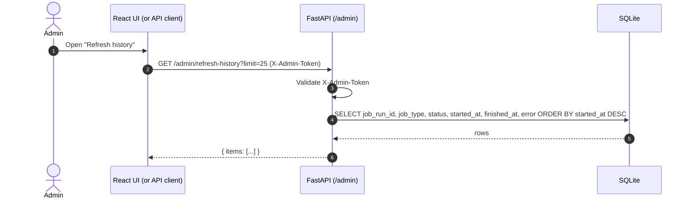
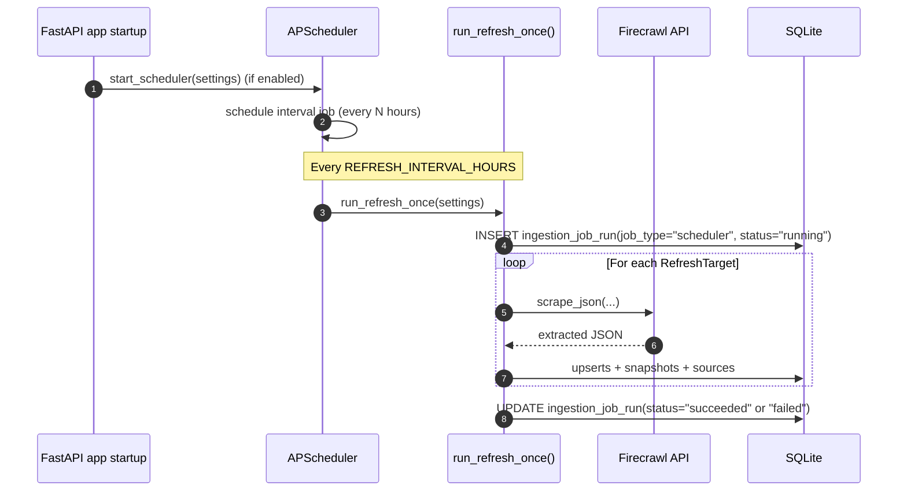

## Sequence Diagrams — Savings Yield Optimiser

These diagrams reflect the current implementation of the **read path** (tables), the **refresh pipeline** (scheduler + admin), and the **scrape → upsert** ingestion flow.

---

## 1) Table load (Fixed Savings / Cash ISA)

Notes:
- `term_months=0` is the stable **sentinel** meaning “All terms”.
- Response shape is always `{ "items": [...] }`.

---

## 2) Admin refresh (sync / wait=true)

Failure path (sync):
- If an exception escapes the refresh orchestration, the API marks the run as `failed` and returns HTTP 500.

---

## 3) Admin refresh (async / wait=false) + in-memory status

Important behavior:
- `/admin/refresh/{job_id}` is **in-memory** (only works for the current server process).
- Persisted cross-restart visibility is provided by `/admin/refresh-history`.

---

## 4) Refresh job history (persisted)

---

## 5) Scheduler refresh (background cadence)

